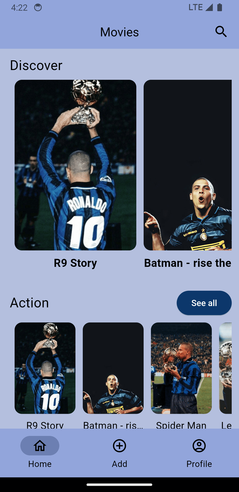

# movie_app

final version of A simple Flutter project connected to an internal database with the ability to add, read and delete boxes & Switch between dark mode and light mode.

## Darkmode

  
  
  
  
  
  

## Lightmode

  
  
  
  
  
  

